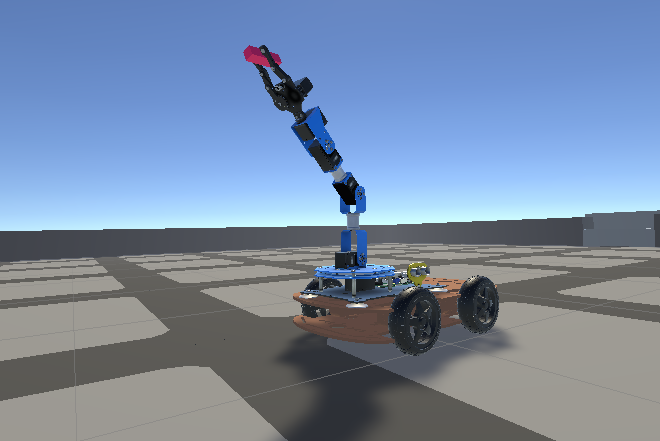
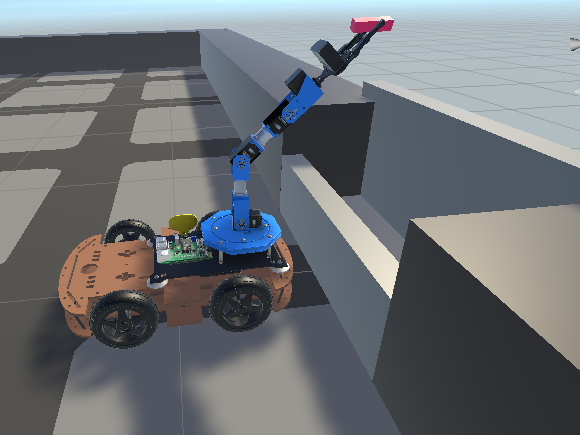

Greg Attra
04/16/2021

# Final Report

## Summary
Roborex is a four-wheeled robot arm which picks up items and returns them to a dropbox location. [Here](https://github.com/gbattra/rex-the-robot) is a link to the code repository. [Here](https://youtu.be/ImJX1mifpsY) is a short video of the robot in action.

[](https://youtu.be/ImJX1mifpsY)

## Implementation

### Simulator
I used the Unity simulator within which to run my experiments. Unity uses Nvidia’s PhysX engine. Unity also provides packages for computer vision, machine learning and reinforcement learning, and communication via ROS. The Unity asset store provides realistic realistic 3D renderings of common objects, which may enable me to use pre-trained neural networks to handle detection and segmentation.

### Backend
I used ROS as the backend system for controlling the robot. The overall system can be broken into four main behaviors:
1. Go-to-goal (target item position)
2. Grasp target item
3. Go-to-goal (dropbox position)
4. Drop item

----

*Go-to-goal (GTG) - Target Item*


The GTG node is instantiated with a reference to a `targetPoseSubscriber` and a `basePoseSubscriber`. The `targetPoseSubscriber` provides the world position of the target item and the angle `wT` of that position relative to the position of the mobile base. The `basePoseSubscriber` similarly provides the world position of the mobile base and the angle `wR` of its forward direction with respect to its origin. The GTG behavior uses these values to compute and publish the `angle` by which to rotate the body of the robot, and the `velocity` by which to move in the forward direction.

The `wT` and `wR` angle values are passed through a PID controller to regulate the amount by which the mobile base should rotate. When the mobile base is directly facing the item, these two angle values should be equal and so the PID controller will return `0` for the `angle` value.

```
float e = target_pose.angle - base_pose.angle;
float e_norm = atan2(sin(e), cos(e));
float w = pid.regulate(e_norm);
```

The world positions of the target and robot are used to calculated the distance between the two objects. Using this distance the GTG behavior computes the `velocity` value to publish. If that distance is below a threshold, `velocity` is set to `0`.

```
float xd = target_pose.x - base_pose.x;
float yd = target_pose.y - base_pose.y;
float zd = target_pose.z - base_pose.z;

float d = sqrt((xd * xd) + (yd * yd) + (zd * zd));
```

The `angle` and `velocity` values are publish to the `cmd_vel` topic, which is subscribed to by a game object in the Unity simulation. The `angle` value is used to turn the wheels and the `velocity` is applied to the motor torque of the wheels.

----

*Grasp Target Item*



Once the robot has reached the target item, the behavior mode is switch to `graspTargetBehavior`. This behavior is responsible for planning the arm trajectories for grasping and lifting the target item. It subscribes to the `gripper_goal` topic, where the position of the target relative to the base link of the arm is published. Using this position, it plots a trajectory to place the end effector.

The trajectories for grasping the item can be broken into four parts:
1. Open the end effector
2. Position the end effector
3. Close the end effector
4. Raise the end effector

Trajectories `1`, `3`, and `4` are hardcoded arm configurations. So the bulk of this behavior is in calculating trajectory `2`.

This is accomplished through a mix of probabilistic roadmaps (PRM) and inverse kinematics (IK) using the Jacobian pseudoinverse. Ideally, this could be accomplished using the IK solver alone. Upon implementation, however, I encountered situations where the IK solver would find an awkward solution where the arm either collided with the body of the robot or was positioned such that the end effector would not be able to grasp the target item. Further, there were instances where no solution was found, despite the item being within range of the arm.

To solve this, I implement PRM to generate 1500 sample configurations and use a forward kinematics solver to find the corresponding end effector position. Using the PRM graph of `[config, position]` tuples, the grasp behavior finds the configuration sample with the closest corresponding position to the target position. It then uses this configuration as the starting point for the IK solver to find the exact configuration which reaches the target position.

```
if not self.prm.built:
    self.prm.build_graph(1500, 5, arm_pose)
approx_pose = self.prm.plan(pose_open, target)[-1]
pose_offset = self.ikine.compute_ik(approx_pose, target)
```

*The PRM approximate pose:*


*The IK final pose:*


This addressed the aforementioned issues by simplifying the problem for the IK solver, which then only had to move the arm a small ammount to place the end effector at the target position.

Finally, each trajectory segment is linespaced to 20-40 intermediary poses between the start pose and end pose. This produces a smoother and more stable trajectory.

```
self.traj_to_linespace(arm_pose, pose_open, 20)
self.traj_to_linespace(pose_open, pose_offset, 40)
self.traj_to_linespace(pose_offset, pose_close, 20)
self.traj_to_linespace(pose_close, pose_raise, 40)
```

----

*Go-to-goal - Dropbox*



Once the item has been grasped and lifted, the behavior mode switches back to go-to-goal. This time, however, the `targetPoseSubscriber` provided to that behavior is subscribed to the `dropbox_pose` topic. So the resulting `angle` and `velocity` commands steer the robot to the dropbox location.

----

*Drop item*


Once the robot has reached the dropbox station, the behavior mode switches back to trajectory planning. The planner itself is again a mix of PRM and IK, with the trajectory being broken up into two parts:
1. Position end effector
2. Open end effector

Again, the "open" trajectory is hardcoded, so the planner simply needs to move the end effector above the dropbox container. A "release" position is defined relative to the base link of the robot arm. The planner builds a PRM of `arm configuration -> eff position` samples and finds the closest match. From there, the IK solver moves the end effector to the exact position above the dropbox container.

*Placement pose:*


----

## Acknowledgements & Resources

* [ROS Wiki](http://wiki.ros.org/Documentation)
* [Georgia Tech "Mobile Robotics" Online Course](https://www.youtube.com/watch?v=aSwCMK96NOw&ab_channel=mouhknowsbest)
* [Unity Robotics Hub](https://github.com/Unity-Technologies/Unity-Robotics-Hub)
* [Peter Corke's "Robotics, Vision and Control"](https://petercorke.com/books/robotics-vision-control-all-versions/)
